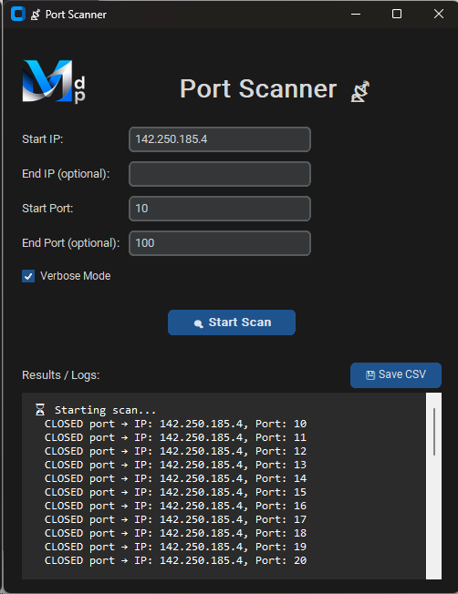

#  &nbsp;&nbsp;   📡 Port Scanner

## Fast and reliable  `Port Scanner` for `Windows` or `Linux`

# Quick Overview

his application provides a fast, modern, and intuitive GUI for scanning open ports across IP ranges on your local network. Detect services, troubleshoot connectivity, and audit devices — all from a sleek interface. No complex tools, no command line: just run and scan.

# Repository Contents

    📦 PortScanner.py: - Main Python script (fully in English)
    📦 PortScanner - ES.py: - Python script (translate to Spanish)
    📦 Readme.md: - This documentation file.
    📁 Images/ - Assets for README (logo, screenshot)
      ├ 📦 Github.png
      └ 📦 Screenshot.png

# Features

- **Cross-platform**: Works seamlessly on Windows and Linux.
- **Multi-IP aware**: Automatically lists all local IPv4 addresses at startup.
- **Modern GUI**: GUI up to date — no more outdated "Windows 95" interfaces.
- **Scan any range**: Define start/end IPs and ports (supports single IPs or full subnets).
- **Real-time logging**: See open (and closed, in verbose mode) ports as they're found.
- **Safe & controlled**: Uses short timeouts and non-blocking sockets to keep the UI responsive.
- **Cancel anytime**: Stop long scans instantly with one click.
- **Export results**: Save all open ports to a CSV file for reporting or analysis.
- **No admin rights needed** – runs entirely in user space.
- **Thread-safe design**: Scanning happens in the background — the GUI never freezes.

# Requirements

This script uses only two external packages (not part of Python’s standard library):
    BASH:
    pip install customtkinter Pillow

- ✅ Tested on Python 3.9+
- ❌ No additional modules like Flask, Django, or Node.js are required.

# Quick Start

1. Download PortScanner.py

2. Place it anywhere — it doesn’t need to be in a specific folder.

3. Run the script:
   
   - *python PortScanner.py*

4. A window will appear showing:
   
   - Your local IP addresses (e.g., 192.168.1.25)
   - Input fields for Start IP, End IP, Start Port, and End Port. 
            *(If the End IP or End Port are the same that Start, just left empty)*
   - A Verbose Mode checkbox (to log closed ports)

5. Fill in your scan range (e.g., 192.168.1.1 to 192.168.1.10, port 80 to 90).

6. Click `🔍 Start Scan`.
7. Watch results appear in real time!
8. When done:

    Click `💾 Save CSV` to export open ports.
    Or click `❌ Stop Scan` to cancel early.
   

# Screenshots

(*Ip Adresses hidden in the capture*)

# Stopping the Server

- Click the `⏹ Stop Server` button in the GUI, or
- Close the application window
  (The server shuts down cleanly in both cases)

# ✨ Use Cases

- Discover active devices and open services on your home or office network.
- Verify firewall rules by checking which ports are truly open.
- Troubleshoot why a local web server or database isn’t reachable.
- Audit IoT devices for unexpected open ports.
- Teach network fundamentals in educational settings.

# How It Works

- Backend: Uses Python’s built-in socket module with connect_ex() for fast TCP scanning.
- Concurrency: Scanning runs in a background thread; UI stays responsive.
- Cancellation: Implemented via threading.Event for clean, cooperative shutdown.
- Safety: Each connection uses a 5ms timeout to avoid hanging on unresponsive hosts.

# License

MIT License — free to use, modify, and distribute.

See [LICENSE](https://opensource.org/license/mit) for details.

# 💬 Feedback & Contributions
Found a bug? Have a feature idea?

👉 Open an [Issue](https://github.com/MiguelAdePablo/PortScanner/issues) or submit a PR!

# 🌐 Useful Links

- [Apps Index](https://github.com/MiguelAdePablo/apps)
- [General Index](https://github.com/MiguelAdePablo/Index)

        Developed with ❤️ using Python and customtkinter
        By Miguel Ángel de Pablo
